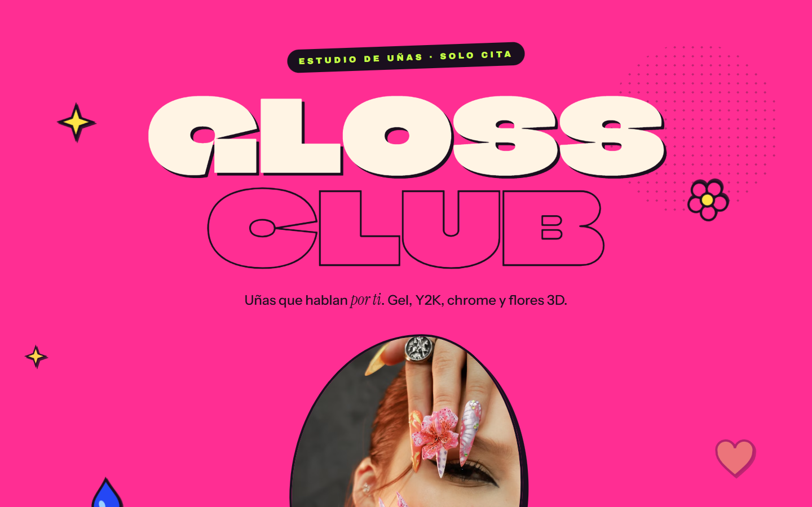
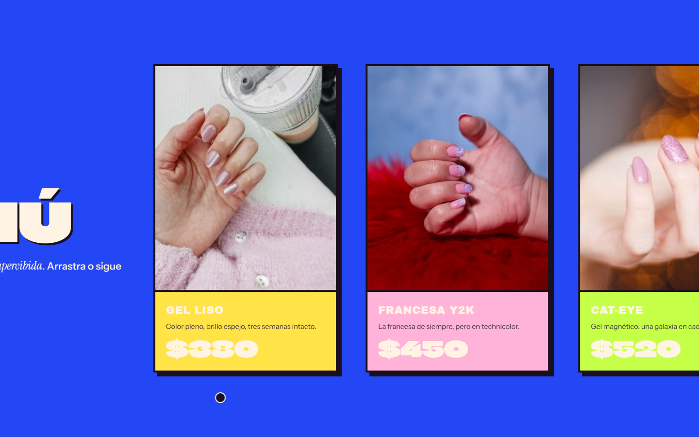

# GLOSS CLUB — Uñas que hablan por ti

**Ver en vivo → [https://b0b1a6ae23.github.io/gloss-club/](https://b0b1a6ae23.github.io/gloss-club/)**


Landing **maximalista pop Y2K** para un club de uñas: colores que mutan, marquees
inclinados, reel horizontal y cortes duros — todo narrado únicamente con scroll,
sin ningún chrome de reproductor.

| Hero | Sección |
| --- | --- |
|  |  |

## Técnicas

- **Morph de color global del body** entre secciones con un `onUpdate` único basado en
  `getBoundingClientRect` (geometría viva: inmune a pin-spacers y resize).
- **Reel horizontal pinned** (scrub) en desktop; en táctil degrada a `overflow-x`
  nativo con `scroll-snap`.
- Sticky-stack de paneles con cortes duros, velocity-skew al scrollear, marquees CSS.
- **Lenis** para smooth scroll (integrado al ticker de GSAP).
- GIFs de Giphy y fotografía Pexels por hotlink, `srcset` runtime (480–1600 px).
- Cursor custom y micro-interacciones solo bajo `(hover: hover)`.

## Responsive

Breakpoint único de animación (800 px) espejado CSS ↔ `gsap.matchMedia`, `svh` con
fallback `vh`, `overflow-x: clip`, safe-areas y pins desactivados en pantallas bajas.

## Cómo correr

```bash
npx http-server . -p 8080
```

## Licencia

Código bajo licencia [MIT](LICENSE). **GLOSS CLUB** es una marca ficticia creada para demostrar trabajo de portafolio; cualquier parecido con un negocio real es coincidencia. Los recursos de terceros (fotografías, videos y modelos 3D) conservan la licencia original de sus autores — ver Créditos.

## Créditos

Fotografía: [Pexels](https://www.pexels.com) · GIFs: [Giphy](https://giphy.com).

---
**Ángel Josué García Cantero** · Serie *páginas-película*.